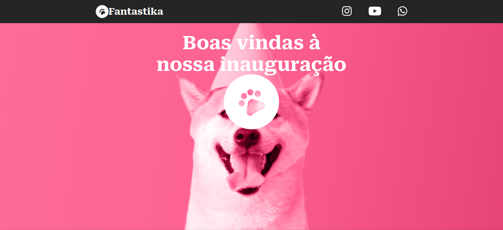

<h1 align="center"> Desafio Final Módulo 1 - Fantastika - Vai Na Web </h1>

 
  <a href="#-projeto">Projeto</a>&nbsp;&nbsp;&nbsp;|&nbsp;&nbsp;&nbsp;
  <a href="#-tecnologias">Tecnologias</a>&nbsp;&nbsp;&nbsp;|&nbsp;&nbsp;&nbsp;
  <a href="#memo-licença">Licença</a>

  

 

## 💻 Projeto

Esse é o desafio final do módulo 1 proposto no curso de formação Front END da escola <a href="https://vainaweb.com.br/" target="_blank">Vai na Web<a>. Nele trabalhamos CSS Flexbox entre outras disciplinas passadas durante o curso.

- [Visite o projeto online](https://doougg26.github.io/Fantastika/)
- [Layout original do projeto](https://xd.adobe.com/view/c20d8ff9-baf0-4a06-b200-3ffde9c66040-975e/screen/af5cc547-c866-4eef-a092-487cd6f6c6aa/)

## 🔌 Tecnologias

Esse projeto foi desenvolvido com as seguintes tecnologias:

- HTML 
- CSS
- Git e Github

## :memo: Licença

Esse projeto está sob a licença MIT.

